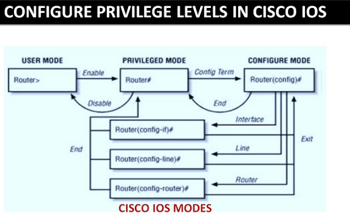
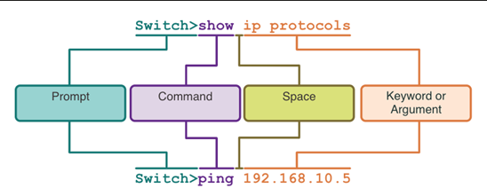
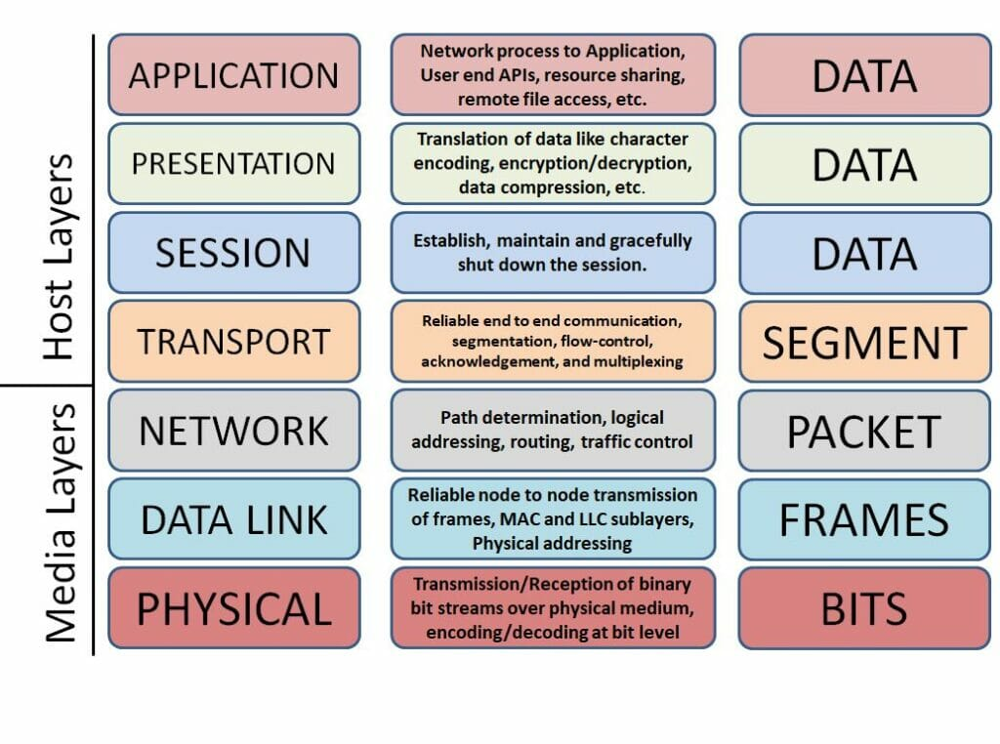
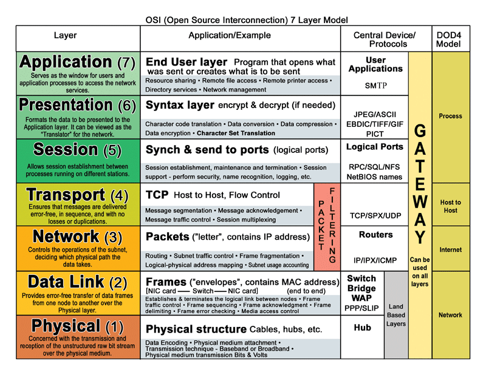

# P1 - Networking Essentials
## 1. IOS Navigation



## 2. Command Structure



## 3. Basic device configuration

### 3.1 Hostname
Mode: `Configure Mode` 

**Set Hostname**
```
Switch> enable
Switch# configure terminal
Switch(config)# hostname <hostname>
```

**Unset Hostname**
```
Switch> enable
Switch# configure terminal
Switch(config)# no hostname
```

### 3.2 Configure passwords

#### 3.2.1 Secure user EXEC mode access
Mode: `Configure Mode Line`

**Set Console access password**
```
Switch> enable
Switch# configure terminal
Switch(config)# line console 0
Switch(config-line)# password <password>
Switch(config-line)# login
Switch(config-line)# end
```

**Unset Console access password**
```
Switch> enable
Switch# configure terminal
Switch(config)# line console 0
Switch(config-line)# no password <password>
Switch(config-line)# no login
Switch(config-line)# end
```

#### 3.2.2 Secure privileged EXEC mode access
**Mode:** `Configure Mode`

**Set privileged EXEC mode access password**
```
Switch> enable
Switch# configure terminal
Switch(config)# enable secret <password>
Switch(config)# exit
```

**Unset privileged EXEC mode access password**
```
Switch> enable
Switch# configure terminal
Switch(config)# no enable secret <password>
Switch(config)# exit
```

#### 3.2.3 Secure VTY line access
**Mode:** `Configure Mode Line`

**Set VTY lines access password**
```
Switch> enable
Switch# configure terminal
Switch(config)# line vty <start> <stop>
Switch(config-line)# password <password>
Switch(config-line)# login
Switch(config-line)# end
```

**Unset VTY lines access password**
```
Switch> enable
Switch# configure terminal
Switch(config)# line vty <start> <stop>
Switch(config-line)# no password <password>
Switch(config-line)# no login
Switch(config-line)# end
```

#### 3.2.4 Encrypt passwords
**Mode:** `Configure Mode`

**Enable password encryption**
```
Switch> enable
Switch# configure terminal
Switch(config)# service password-encryption
Switch(config)# exit
```

**Disable password encryption**
```
Switch> enable
Switch# configure terminal
Switch(config)# no service password-encryption
Switch(config)# exit
```

### 3.3 Banner messages
**Mode:** `Configure Mode`

**Set banner message**
```
Switch> enable
Switch# configure terminal
Switch(config)# banner motd #Authorized access only!#
```

**Unset banner message**
```
Switch> enable
Switch# configure terminal
Switch(config)# no banner motd
```

### 3.4 Configurations

#### 3.4.1 Show configuration
**Mode:** `Privileged Mode`

**Show running configuration**
```
Switch> enable
Switch# show running-configuration
```

**Show startup configuration**
```
Switch> enable
Switch# show startup-configuration
```

#### 3.4.2 Save configuration
**Mode:** `Privileged Mode`

**Set current running configuration as startup configuration**
```
Switch> enable
Switch# copy running-configuration startup-configuration
```

#### 3.4.3 Erase configuration
**Mode:** `Privileged Mode`

**Erase running configuration**
```
Switch> enable
Switch# reload
```

**Erase startup configuration**
```
Switch> enable
Switch# erase startup-configuration
```

## 4. Basic router configuration

### 4.1 Configure interfaces

#### 4.1.1 Router interfaces
**Mode:** `Configure Mode Interface`

**Set router interface**

*Ethernet interface*
```
Router> enable
Router# configure terminal
Router(config)# interface <interface-id>
Router(config-if)# description <destcription>
Router(config-if)# ip address <ipv4-address> <subnet-mask>
Router(config-if)# ipv6 address <ipv6-address>/<prefix-length>
Router(config-if)# no shutdown
Router(config-if)# exit
```

*Serial interface*
```
Router> enable
Router# configure terminal
Router(config)# interface <interface-id>
Router(config-if)# description <destcription>
Router(config-if)# ip address <ipv4-address> <subnet-mask>
Router(config-if)# clock rate <clock-rate>
Router(config-if)# no shutdown
Router(config-if)# exit
```

**Unset router interface**
*Ethernet interface*
```
Router> enable
Router# configure terminal
Router(config)# interface <interface-id>
Router(config-if)# no description
Router(config-if)# noip address <ipv4-address> <subnet-mask>
Router(config-if)# no ipv6 address <ipv6-address>/<prefix-length>
Router(config-if)# shutdown
Router(config-if)# exit
```

*Serial interface*
```
Router> enable
Router# configure terminal
Router(config)# interface <interface-id>
Router(config-if)# no description
Router(config-if)# noip address <ipv4-address> <subnet-mask>
Router(config-if)# no clock rate
Router(config-if)# shutdown
Router(config-if)# exit
```

### 4.2 Setup routing

### 4.2.1 Routing for IPv4
**Mode:** `Configure Mode`

**Set router networks**
```
Router> enable
Router# configure terminal
Router(config)# router rip
Router(config-router)# network <ip>
Router(config-router)# network <ip>
```

**Unset router networks**
```
Router> enable
Router# configure terminal
Router(config)# no router rip
Router(config-router)# no network <ip>
Router(config-router)# no network <ip>
```

### 4.2.2 Routing for IPv6
**Mode:** `Configure Mode`

**Enable unicast routing**
```
Router> enable
Router# configure terminal
Router(config)# ipv6 unicast-routing
Router(config-if)# interface g0/0/0
Router(config-if)# ipv6 rip route1 enable
Router(config-if)# interface g0/0/1
Router(config-if)# ipv6 rip route1 enable
```

**Disable unicast routing**
```
Router> enable
Router# configure terminal
Router(config)# ipv6 unicast-routing
Router(config-rtr)# interface g0/0/0
Router(config-if)# no ipv6 rip route1 enable
Router(config-if)# interface g0/0/1
Router(config-if)# no ipv6 rip route1 enable
```

### 4.3 Show interface information
**Mode:** `Privileged Mode`

**Show ipv4 interfaces**
```
Router> enable
Router# show ip interface brief
```

**Show ipv6 interfaces**
```
Router> enable
Router# show ipv6 interface brief
```

**Show ipv4 routing paths**
```
Router> enable
Router# show ip route
```

**Show ipv6 routing paths**
```
Router> enable
Router# show ipv6 route
```

**Show comprehensive details about specific interface**
- Physical status (up or down)
- Data link layer information (e.g., duplex, speed)
- Packet statistics (input/output packets, errors)
- Interface configuration settings
- Detailed information about encapsulation, MTU, and other link-layer parameters.

```
Router> enable
Router# show interfaces <interface>
```

**Show specific ipv4-related aspects of the specific interface**
- IP address and subnet mask
- Status of the IP interface (up or down)
- Whether IP routing is enabled
- Access list configurations related to the interface
- Information on whether the interface is configured for proxy ARP.

```
Router> enable
Router# show ip interface <interface>
```

**Show specific ipv6-related aspects of the specific interface**
- **Interface Status**: Up or down state of the interface.
- **IPv6 Addresses**: Assigned IPv6 addresses (link-local and global) and prefix lengths.
- **MTU**: Configured Maximum Transmission Unit size for IPv6 packets.
- **Link-Local Address**: Automatically generated link-local address.
- **Neighbor Discovery**: Status of Neighbor Discovery Protocol (NDP).
- **IPv6 Routing**: Whether IPv6 routing is enabled.
- **Traffic Statistics**: Input/output packet counts and errors specific to IPv6.
- **Autoconfiguration**: Status of Stateless Address Autoconfiguration (SLAAC).
- **Access Lists**: Any applied IPv6 access control lists (ACLs).

```
Router> enable
Router# show ipv6 interface <interface>
```

## 5. Set default gateway

### 5.1 Switch (Layer 2)
**Mode:** `Configure Mode`

**Set default gateway**
```
Switch> enable
Switch# configure terminal
Switch(config)# ip default-gateway <ip-address>
```

**Unset default gateway**
```
Switch> enable
Switch# configure terminal
Switch(config)# no ip default-gateway
```

### 5.2 Router (Layer 3)
**Mode:** `Configure Mode`

**Set default gateway (gateway of last resort)**
```
Router> enable
Router# configure terminal
Router(config)# ip route 0.0.0.0 0.0.0.0 <next-hop-ip-address>
```

**Unset default gateway (gateway of last resort)**
```
Router> enable
Router# configure terminal
Router(config)# no ip route 0.0.0.0 0.0.0.0 <next-hop-ip-address>
```

## 6. Verify connectivity

### 6.1 Ping
**Mode:** `Privileged Mode`

**Simple ping**
```
Router> enable
Router# ping <target>
```

**Extended ping**
```
Router> enable
Router# ping
```

### 6.2 Traceroute
**Mode:** `Privileged Mode`

**Simple tracert**
```
Router> enable
Router# tracert <target>
```

**Extended tracert**
```
Router> enable
Router# tracert
```

### 7. General information
**Mode:** `Privileged Mode`

**Show CDP neighbor information**
```
Router> enable
Router# show cdp neighbors
```

**Show version**
```
Router> enable
Router# show version
```

**Show mac address table**
```
Router> enable
Router# show mac address-table
```

## 8. Troubleshooting

### 8.1 Debug command
**Mode:** `Privileged Mode`

**Turn on debug messages for set target**
```
Router> enable
Router# debug <target>
```

**Turn off all debug messages**
```
Router> enable
Router# undebug
```

### 8.2 Terminal monitor command
**Mode:** `Privileged Mode`

**Enable showing log messages on VTY lines (remote)**
```
Router> enable
Router# terminal monitor
```

**Disable showing log messages on VTY lines (remote)**
```
Router> enable
Router# terminal no monitor
```

## 9. Remote access commands

### 9.1 Unprotected remote access (Telnet)
**Mode:** `Configure Mode Line`

**Specifically define telnet as transport input (normally default)**
```
Router> enable
Router# configure terminal
Router(config)# line vty <start> <stop>
Router(config-line)# password <password>
Router(config-line)# login
Router(config-line)# transport input telnet
Router(config-line)# end
```
*Setting an ip address can also be done in a manner similar to setting it to an interface*

### 9.2 Protected remote access (SSH)

#### 9.2.1 Setup SSH
**Mode:** `Configure Mode Line`

**Set transport input for scope to SSH**
```
Router> enable
Router# configure terminal
Router# ip domain-name <domain>
Router# crypto key generate rsa general-keys modulus 1024
Router# username <username> secret <password>
Router(config)# line vty <start> <stop>
Router(config-line)# login local
Router(config-line)# transport input ssh
Router(config-line)# end
```

**Unset transport input for scope to SSH**
```
Router> enable
Router# configure terminal
Router# no ip domain-name <domain>
Router# crypto key zeroize rsa
Router# no username <username>
Router(config)# line vty <start> <stop>
Router(config-line)# no login local
Router(config-line)# transport input telnet
Router(config-line)# end
```
*`transport input none` is also possible*

#### 9.2.2 Verify SSH is Operational
**Mode:** `Privileged Mode`

**Show information about the SSH server configuration**
```
Router> enable
Router# show ip ssh
```

**Show detailed information about active SSH sessions on the device**
```
Router> enable
Router# show ssh
```

## 10. VLANs

### 10.1 VLAN Configuration

#### 10.1.1 Configure VLANs
**Mode:** `Configure Mode`

**Create VLAN with set name**
```
Switch> enable
Switch# configure terminal
Switch(config)# vlan <vlan-id>
Switch(config-vlan)# name <vlan-name>
Switch(config-vlan)# end
```

**Remove VLAN with set name**
```
Switch> enable
Switch# configure terminal
Switch(config)# no vlan <vlan-id>
Switch(config)# end
```

#### 10.1.2 Configure VLAN SVI on a switch
*Logical interfaces at Layer 3 for routing between VLANs*
**Mode:** `Configure Mode Interface`

**Setup SVI for set VLAN**
```
Switch> enable
Switch# configure terminal
Switch(config)# interface vlan <vlan-id>
Switch(config-vlan)# ip address <ip-address> <subnet-mask>
Switch(config-vlan)# no shutdown
Switch(config-vlan)# end
```

**Remove SVI for set VLAN**
```
Switch> enable
Switch# configure terminal
Switch(config)# no interface vlan <clan-id>
Switch(config)# end
```

#### 10.1.3 Setup physical interfaces for VLANs
**Mode:** `Configure Mode Interface`

**Setup Data VLAN interface**
```
Switch> enable
Switch# configure terminal
Switch(config)# interface <interface-id>
Switch(config-if)# switchport mode access
Switch(config-if)# switchport access vlan <vlan-id>
Switch(config-if)# end
```

**Setup Voice VLAN interface**
```
Switch> enable
Switch# configure terminal
Switch(config)# interface <interface-id>
Switch(config-if)# mls qos trust cos
Switch(config-if)# switchport voice vlan <vlan-id>
Switch(config-if)# end
```

#### 10.1.4 Change VLAN port membership
**Mode:** `Configure Mode Interface`

**Place interface back in VLAN 1**
```
Switch> enable
Switch# configure terminal
Switch(config)# interface <interface-id>
Switch(config-if)# no switchport access vlan
Switch(config-if)# end
```

#### 10.1.5 Verify VLAN information
**Mode:** `Privileged Mode`

**Show VLAN information**
```
Switch> enable
Switch# configure terminal
Switch(config)# show vlan [ brief | id <vlan-id> | name <vlan-name> | summary ]
```

### 10.2 VLAN Trunks

#### 10.2.1 Configure Trunks
**Mode:** `Configure Mode Interface`

**Enable VLAN Trunk**
```
Switch> enable
Switch# configure terminal
Switch(config)# interface <interface-id>
Switch(config-if)# switchport trunk encapsulation dot1q
Switch(config-if)# switchport mode trunk
Switch(config-if)# switchport trunk native vlan <vlan-id>
Switch(config-if)# switchport trunk allowed vlan <vlan-list>
Switch(config-if)# end
```

**Disable VLAN Trunk**
```
Switch> enable
Switch# configure terminal
Switch(config)# interface <interface-id>
Switch(config-if)# switchport mode access
Switch(config-if)# end
```

### 10.2.2 Verify Trunk configuration
**Mode:** `Privileged Mode`

```
Switch> enable
Switch# show interfaces <interface-id> switchport
Switch(config)# interface <interface-id>
Switch(config-if)# switchport mode access
Switch(config-if)# end
```

#### 10.2.3 Reset the trunk to the Default state
**Mode:** `Configure Mode Interface`

```
Switch> enable
Switch(config)# interface <interface-id>
Switch(config-if)# no switchport trunk allowed vlan
Switch(config-if)# no switchport trunk native vlan
Switch(config-if)# end
```

### 10.3 Dynamic Trunking Protocol

#### 10.3.1 Configure Dynamic Trunking Protocol
**Mode:** `Configure Mode Interface`

**Enable Dynamic Trunking Protocol**
```
Switch> enable
Switch# configure terminal
Switch(config)# interface <interface-id>
Switch(config-if)# switchport mode trunk
Switch(config-if)# switchport nonegotiate
Switch(config-if)# switchport mode dynamic auto
Switch(config-if)# end
```

#### 10.3.2 Verify Dynamic Trunking Protocol
**Mode:** `Privileged Mode`

**Show information about Dynamic Trunking Protocol Interface**
```
Switch> enable
Switch# show dtp interface <interface-id>
```

## 11. Inter-VLAN Routing

### 11.1. Setup Inter-VLAN Routing

#### 11.1.1 Allow Inter-VLAN instead of only mac address routing
**Mode:** `Privileged Mode`

**Allow Inter-VLAN routing**
```
SwitchL3> enable
SwitchL3# ip routing
```

#### 11.1.2 Setup routing method
**Mode:** `Configure Mode`

**Setup method OSPFv2**
```
Switch> enable
Switch# configure terminal
Switch(config)# router ospf 10
Switch(config-router)# network <ip-address> <subnet-mask> area <area-id>
Switch(config-router)# network <ip-address> <subnet-mask> area <area-id>
Switch(config-router)# ...
```

****
# P2 - Networking Advanced

## 1. Common Ports

| Port Number | Protocol | Application                                         |
| ----------- | -------- | --------------------------------------------------- |
| 20          | TCP      | File Transfer Protocol (FTP) - Data                 |
| 21          | TCP      | File Transfer Protocol (FTP) - Control              |
| 22          | TCP      | Secure Shell (SSH)                                  |
| 23          | TCP      | Telnet                                              |
| 25          | TCP      | Simple Mail Transfer Protocol (SMTP)                |
| 53          | UDP, TCP | Domain Name Service (DNS)                           |
| 67          | UDP      | Dynamic Host Configuration Protocol (DHCP) - Server |
| 68          | UDP      | Dynamic Host Configuration Protocol - Client        |
| 69          | UDP      | Trivial File Transfer Protocol (TFTP)               |
| 80          | TCP      | Hypertext Transfer Protocol (HTTP)                  |
| 110         | TCP      | Post Office Protocol version 3 (POP3)               |
| 143         | TCP      | Internet Message Access Protocol (IMAP)             |
| 161         | UDP      | Simple Network Management Protocol (SNMP)           |
| 443         | TCP      | Hypertext Transfer Protocol Secure (HTTPS)          |

## 2. Spanning Tree Protocol

### 2.1 Configuring Spanning Tree
**Mode:** `Configure Mode Interface`

**Enable Spanning tree**
```
Switch> enable
Switch# configure terminal
Switch(config)# interface <interface-id>
Switch(config-if)# spanning-tree
```

**Disable Spanning tree**
```
Switch> enable
Switch# configure terminal
Switch(config)# interface <interface-id>
Switch(config-if)# no spanning-tree
```

### 2.2 Configuring PortFast and BPDU Guard

#### 2.2.1 On a specific interface
**Mode:** `Configure Mode Interface`

**Enable PortFast and BPDU Guard**
```
Switch> enable
Switch# configure terminal
Switch(config)# interface <interface-id>
Switch(config-if)# spanning-tree portfast
Switch(config-if)# spanning-tree bpduguard enable
```

#### 2.2.2 Enable BPDU Guard on every interface that has PortFast enabled
**Mode:** `Configure Mode`

**Enable PortFast and BPDU Guard on specific interface**
```
Switch> enable
Switch# configure terminal
Switch(config)# spanning-tree portfast default
Switch(config)# spanning-tree bpduguard enable
```

## 3. EtherChannel

### 3.1 LACP

#### 3.1.1 Configure LACP
**Mode:** `Configure Mode Interface`

**Setup LCAP for range of interfaces**
```
Switch> enable
Switch# configure terminal
Switch(config)# interface range <start> <stop>
Switch(config-if-range)# channel-group <identifier> mode active
Switch(config-if-range)# exit
Switch(config-if)# interface port-channel <identifier>
Switch(config-if)# switchport mode trunk
Switch(config-if)# switchport trunk allowed vlan <vlan-range> 
```

# 3.2 Verify and troubleshoot EtherChannel
**Mode:** `Privileged Mode`

**Display the general status of the port channel interface**
```
Switch> enable
Switch# show interfaces port-channel <identifier>
```

**Display one line of information per port channel**
```
Switch> enable
Switch# show etherchannel summary
```

**Display information about a specific port channel interface**
```
Switch> enable
Switch# show etherchannel port-channel
```

**Provide information about the role of a physical member interface of the EtherChannel**
```
Switch> enable
Switch# show interfaces <interface-id> etherchannel
```
## 4. DHCPv4

### 4.1 Configure Cisco IOS DHCPv4 Server
**Mode:** `Configure Mode`

**Setup DHCPv4**

1. Exclude IPv4 addresses
2. Define a DHCPv4 pool name
3. Configure the DHCPv4 pool

```
Router> enable
Router# configure terminal
Router(config)# ip dhcp excluded-address <start-address> <stop-address>
Router(config)# ip dhcp excluded-address <ip-address>
Router(config)# ip dhcp pool <pool-name>
Router(dhcp-config)# network <network-number> [ <subnet-mask> / <prefix-length> ]
Router(dhcp-config)# default-router <ip-address> [ <ip-address> ... ]
Router(dhcp-config)# dns-server <ip-address> [ <ip-address> ... ]
Router(dhcp-config)# domain-name <domain>
Router(dhcp-config)# lease { days [ hours [ minutes ] ] infinite }
Router(dhcp-config)# netbios-name-server <ip-address> [ <ip-address> ... ]
```
- *You can use both ranges or a single ip when excluding*
- *some commands are optional (namely the 2 last ones*

**Disable DHCPv4**
```
Router> enable
Router# configure terminal
Router(config)# no ip dhcp excluded-address <start-address> <stop-address>
Router(config)# no ip dhcp excluded-address <ip-address>
Router(config)# no ip dhcp pool <pool-name>
Router(config)# no ip dhcp pool
```

### 4.2 DHCPv4 Verification
**Mode:** `Privileged Mode`

**Display the DHCPv4 commands configured on the router**
```
Router> enable
Router# show running-config | section dhcp
```

**Display list of all IPv4 to MAC address binding provided**
```
Router> enable
Router# show ip dhcp binding
```

**Displays count information regarding the number of DHCPv4 messages**
```
Router> enable
Router# show ip dhcp server statistics 
```

## 5. SLAAC and DHCPv6
### 5.1 Configuring SLAAC

#### 5.1.1 Enable SLAAC
**Mode:** `Configure Mode`

**Enable SLAAC**
```
Router> enable
Router# configure terminal
Router(config)# ipv6 unicase-routing
Router(config)# exit
```

#### 5.1.2 Verify that the router has joined the IPv6 all-routers group
**Mode:** `Privileged Mode`

**Show information about the IPv6 interface**
```
Router> enable
Router# show IPv6 interface <interface-id> | section joined
```

### 5.2 Stateless DHCPv6

#### 5.2.1 Enable Stateless DHCPv6 on an interface
**Mode:** `Configure Mode Interface`

**Enable Stateless DHCPv6 on an interface**
```
Router> enable
Router# configure terminal
Router(config)# interface <interface-id>
Router(config-if)# ipv6 nd other-config-flag
Router(config-if)# end
```

#### 5.2.2 Verify
**Mode:** `Privileged Mode`

**Show information about the IPv6 interface**
```
Router> enable
Router# show IPv6 interface <interface-id> | begin ND
```

### 5.3 Stateful DHCPv6

#### 5.3.1 Enable Stateful DHCPv6 on an interface
**Mode:** `Configure Mode Interface`

**Enable Stateless DHCPv6 on an interface**
```
Router> enable
Router# configure terminal
Router(config)# interface <interface-id>
Router(config-if)# ipv6 nd managed-config-flag
Router(config-if)# ipv6 nd prefix default no-autoconfig
Router(config-if)# end
```

#### 5.3.2 Verify
**Mode:** `Privileged Mode`

**Show information about the IPv6 interface**
```
Router> enable
Router# show IPv6 interface <interface-id> | begin ND
```

### 5.4 Configure DHCPv6 Server
**Mode:** `Configure Mode Interface`

#### 5.4.1 Configure Stateless DHCPv6 Server
**Mode:** `Configure Mode`

1. Enable IPv6 routing
2. Define a DHCPv6 pool name
3. Configure the DHCPv6 pool with options (dns-server & domain-name)
4. Bind the interface to the pool
5. Verify with `ipconfig /all` on the hosts

*Numbers in the router name indicate the step in the process (only in the example)*

```
Router1> enable
Router1# configure terminal
Router1(config)# ipv6 unicast routing
Router2(config)# ipv6 dhcp pool IPV6-STATELESS
Router3(config-dhcpv6)# dns-server <ipv6-address>
Router3(config-dhcpv6)# domain-name <domain-name>
Router3(config-dhcpv6)# exit
Router4(config)# interface <interface-id>
Router4(config)# description <description>
Router4(config)# ipv6 address <ipv6-address> link-local
Router4(config)# ipv6 address <ipc6-address>
Router4(config)# ipv6 nd other-config-flag
Router4(config)# ipv6 dhcp server IPV6-STATELESS
Router4(config)# no shutdown
Router4(config)# end
```

#### 5.4.2 Configure Stateless DHCPv6 Client
**Mode:** `Configure Mode`

1. enable IPv6 routing
2. Configure client router to create an LLA
3. Configure the router to use SLAAC
4. Verify that the client router is assigned a GUA
5. Verify that the client router received other necessary DHCPv6 information

*Numbers in the router name indicate the step in the process (only in the example)*

```
Router1> enable
Router1# configure terminal
Router1(config)# ipv6 unicast routing
Router2(config)# interface <interface-id>
Router2(config-if)# ipv6 enable
Router3(config-if)# ipv6 address autoconfig
Router3(config-if)# exit
Router4# show ipv6 interface brief
Router5# show ipv6 dhcp interface <interface-id>
```

#### 5.4.3 Configure Statefull DHCPv6 Server
**Mode:** `Configure Mode`

1. Enable IPv6 routing
2. Define a DHCPv6 pool name
3. Configure the DHCPv6 pool with options (address prefix, dns-server, domain-name)
4. Bind the interface to the pool
5. Verify with `ipconfig /all` on the hosts

*Numbers in the router name indicate the step in the process (only in the example)*

```
Router1> enable
Router1# configure terminal
Router1(config)# ipv6 unicast routing
Router2(config)# ipv6 dhcp pool IPV6-STATEFULL
Router3(config-dhcpv6)# address prefix <address-prefix>
Router3(config-dhcpv6)# dns-server <ipv6-address>
Router3(config-dhcpv6)# domain-name <domain-name>
Router3(config-dhcpv6)# exit
Router4(config)# interface <interface-id>
Router4(config)# description <description>
Router4(config)# ipv6 address <ipv6-address> link-local
Router4(config)# ipv6 address <ipc6-address>
Router4(config)# ipv6 nd managed-config-flag
Router4(config)# ipv6 nd prefix default no-autoconfig
Router4(config)# ipv6 dhcp server IPV6-STATEFULL
Router4(config)# no shutdown
Router4(config)# end
```

#### 5.4.4 Configure Statefull DHCPv6 Client
**Mode:** `Configure Mode`

1. enable IPv6 routing
2. Configure client router to create an LLA
3. Configure the router to use DHCPv6
4. Verify that the client router is assigned a GUA
5. Verify that the client router received other necessary DHCPv6 information

*Numbers in the router name indicate the step in the process (only in the example)*

```
Router1> enable
Router1# configure terminal
Router1(config)# ipv6 unicast routing
Router2(config)# interface <interface-id>
Router2(config-if)# ipv6 enable
Router3(config-if)# ipv6 address dhcp
Router3(config-if)# exit
Router4# show ipv6 interface brief
Router5# show ipv6 dhcp interface <interface-id>
```

### 5.5 DHCP Server verification commands
**Mode:** `Privileged Mode`

**Verify that the client router received other necessary DHCPv6 information**
```
Router1> enable
Router1# show ipv6 dhcp interface <interface-id>
```

**Verify the name of the DHCPv6 pool and its parameter + identifies number of active clients**
```
Router1> enable
Router1# show ipv6 dhcp pool
```

**Display the IPv6 LLA of the client and the GUA assigned by the server**
```
Router1> enable
Router1# show ipv6 dhcp binding
```

### 5.6 Configure a DHCPv6 Relay Agent
**Mode:** `Configure Mode Interface`

**Enable a DHCPv6 Relay agent**
```
Router1> enable
Router1# configure terminal
Router1(config)# interface <interface-id>
Router1(config-if)# ipv6 dhcp relay destination <ipv6-address>
```

**Verify a DHCPv6 Relay agent**
```
Router1> enable
Router1# show ipv6 dhcp interface
Router1# show ipv6 dhcp binding
```

# 3. EXTRA

## 1. Command filtering

| **Filter Option** | **Description**                                                                                               |
| ----------------- | ------------------------------------------------------------------------------------------------------------- |
| `include`         | Displays only the lines that contain the specified keyword or pattern.                                        |
| `exclude`         | Omits the lines that contain the specified keyword or pattern.                                                |
| `begin`           | Displays the output starting from the first line that matches the specified keyword or pattern.               |
| `section`         | Displays an entire section of the configuration starting from the matching keyword (used in config commands). |

## 2. ISO Model



